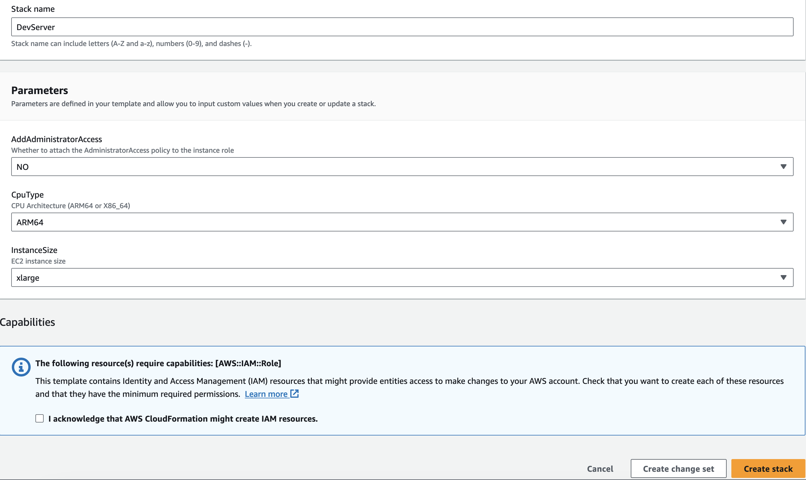

# Simple Dev EC2 Instance

This simple Cloudformation template will deploy a new EC2 instance in a new VPC that can be used for dev work. This instance uses [Amazon Linux 2023](https://aws.amazon.com/linux/amazon-linux-2023/) with either an [ARM64](https://aws.amazon.com/ec2/instance-types/m7g/) or [X86_64](https://aws.amazon.com/ec2/instance-types/m5/) CPU and can be deployed as a `LARGE`, `XLARGE`, or `2XLARGE` instance size. It comes pre-installed with several commonly used packages:

- NodeJS 20
- Python
- pip
- jq
- Docker

## Adding Keys (optional)

If you'd like to copy private or public keys to the instance during deployment, you can add them to SSM before deploying.

```bash
aws ssm put-parameter --name /devServer/publicKey --overwrite --type SecureString --value $(cat ~/.ssh/key.pub | base64)
aws ssm put-parameter --name /devServer/githubKey --overwrite --type SecureString --value $(cat ~/.ssh/private.pem | base64)
```

These commands will base64 encode the contents of these files and store in them in [SSM Parameter Store](https://docs.aws.amazon.com/systems-manager/latest/userguide/systems-manager-parameter-store.html).

During deployment, these parameters will be read and used to configure the instance.

```bash
GITHUB_KEY=$(aws ssm get-parameter --with-decryption --name /devServer/githubKey --query Parameter.Value --output text 2> /dev/null)
EXIT_CODE=$?
if [[ "$EXIT_CODE" -ne 0 ]]; then echo 'No GitHub Key found'; else echo 'Found GitHub Key' && echo $GITHUB_KEY | base64 -d > /home/ubuntu/.ssh/github.pem && chmod 600 /home/ubuntu/.ssh/github.pem && echo -e "Host github.com\n\tIdentityFile ~/.ssh/github.pem" >> /home/ubuntu/.ssh/config; fi
PUBLIC_KEY=$(aws ssm get-parameter --with-decryption --name /devServer/publicKey --query Parameter.Value --output text 2> /dev/null)
EXIT_CODE=$?
if [[ "$EXIT_CODE" -ne 0 ]]; then echo 'No Public Key found'; else echo 'Found Public Key' && echo $PUBLIC_KEY | base64 -d >> /home/ubuntu/.ssh/authorized_keys; fi
chown ubuntu:ubuntu /home/ubuntu/.ssh/*
```

## Security Group

Several TCP ports will be opened in the Security Group.

```yaml
SecurityGroupIngress:
  - IpProtocol: tcp
    FromPort: '22'
    ToPort: '22'
    CidrIp: 0.0.0.0/0
  - IpProtocol: tcp
    FromPort: '80'
    ToPort: '80'
    CidrIp: 0.0.0.0/0
  - IpProtocol: tcp
    FromPort: '443'
    ToPort: '443'
    CidrIp: 0.0.0.0/0
  - IpProtocol: tcp
    FromPort: '3000'
    ToPort: '3000'
    CidrIp: 0.0.0.0/0
  - IpProtocol: tcp
    FromPort: '8080'
    ToPort: '8080'
    CidrIp: 0.0.0.0/0
```

This will open the following ports:

- 22
- 80
- 443
- 3000
- 8080

## Deployment Options



During deployment, you can choose the CPU Type, the Instance Size, Volume Size, and if you wish to add Administrator Access.

> Adding Administrator Access will allow you to use all AWS resources, but **must** be used with caution

[](https://us-east-1.console.aws.amazon.com/cloudformation/home?region=us-east-1#/stacks/create/review?templateURL=https://subaud-resources.s3.amazonaws.com/ec2-cloudformation/template.yaml&stackName=DevServer)
